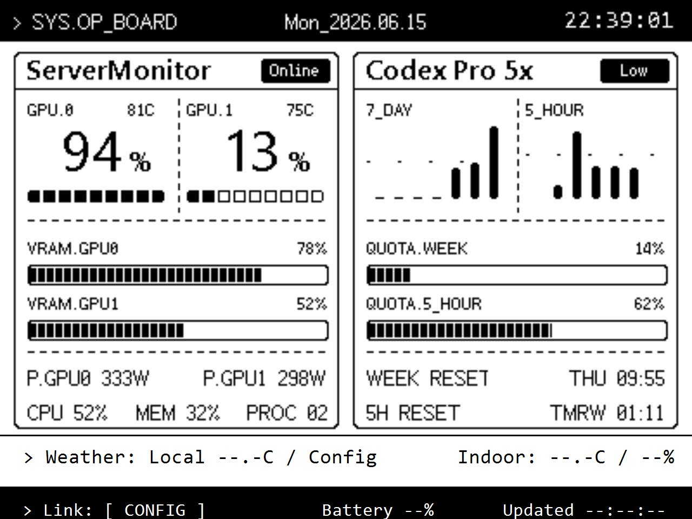

# InfoDashboard


[English](#english) | [中文](#中文)



## English

InfoDashboard is an ESP-IDF and LVGL dashboard for the Waveshare ESP32-S3-RLCD-4.2 board. The firmware targets the board's `400 x 300` monochrome reflective LCD and keeps the implementation on ESP-IDF, not Arduino.

This repository is a public mirror exported from a private source repository. Private deployment history, local project memory, credentials, and site-specific endpoint values are intentionally excluded.

### Highlights

- Two-card dashboard layout for server state and quota-style metrics.
- Footer rows for weather, indoor sensing, link state, battery, and update time.
- Board-local time, battery, and SHTC3 indoor temperature/humidity refresh independently from network data.
- Hardware firmware shows real API data, real cache, board-local sensor data, or explicit empty/config/no-data states. Mock data is limited to preview and tests.

### Layout

```text
firmware/       ESP-IDF application, board code, UI, preview, screenshot tools
.env.example   Optional local environment variable template
LICENSE        Apache-2.0 license
```

### Build

Install ESP-IDF for ESP32-S3, then build from `firmware/`.

```powershell
Push-Location .\firmware
idf.py set-target esp32s3
idf.py build
```

Flash after confirming the correct serial port:

```powershell
idf.py -p COMx flash monitor
```

### Configuration

Runtime values are configured through `idf.py menuconfig` or a local `firmware/sdkconfig` that is not committed.

```text
Info Dashboard Transport
  WiFi SSID: your 2.4 GHz network
  WiFi password: set locally
  Dashboard API latest URL: https://example.com/codex-quota/api/v1/latest
  Dashboard API key: set locally when required
  Open-Meteo current weather URL: Open-Meteo forecast URL for your location
  Weather display location: short display name
  ServerMonitor status URL: https://example.com/server-monitor/api/v1/targets/default/status
  ServerMonitor local status URL 1: optional LAN endpoint
  ServerMonitor local status URL 2: optional LAN endpoint
  ServerMonitor API token: set locally when required
  ServerMonitor display target: short target label
  Cloudflare Access client ID: optional
  Cloudflare Access client secret: optional
```

Do not commit Wi-Fi passwords, API keys, bearer tokens, Cloudflare secrets, local endpoint URLs, generated `sdkconfig`, or build outputs.

### Preview And Screenshot

```powershell
python .\firmware\tools\preview_dashboard.py
```

Open:

```text
http://localhost:8787
```

Fetch the device framebuffer:

```powershell
python .\firmware\tools\fetch_screenshot.py <esp32-host> -o screen.pbm
python .\firmware\tools\fetch_screenshot.py <esp32-host> -o screen.png
```

PNG output requires Pillow; PBM output works without it.

### Data Boundaries

Indoor temperature and humidity come from the board-local SHTC3 sensor over I2C. Weather, server status, and quota-style data are optional external services configured by the device owner. OAuth sessions, refresh tokens, collector internals, and long-lived service credentials must stay on server-side services.

## 中文

InfoDashboard 是面向 Waveshare ESP32-S3-RLCD-4.2 的 ESP-IDF + LVGL 信息看板固件。固件针对板载 `400 x 300` 黑白反射屏设计，不使用 Arduino 栈。

本仓库是从私有源仓库导出的公开镜像；私有部署历史、本地项目记忆、凭据和站点专属 endpoint 不会进入公开仓库。

### 特性

- 双主卡看板布局，展示服务器状态和额度类指标。
- 底部区域显示天气、室内传感器、链路状态、电池和更新时间。
- 时间、电池和 SHTC3 室内温湿度在板端本地刷新，不依赖网络数据。
- 硬件固件只显示真实 API、真实缓存、板载传感器或明确的空/未配置状态；mock 只用于预览和测试。

### 仓库结构

```text
firmware/       ESP-IDF 应用、板级代码、UI、预览和截图工具
.env.example   可选的本地环境变量模板
LICENSE        Apache-2.0 许可证
```

### 构建

安装 ESP32-S3 对应 ESP-IDF 后，从 `firmware/` 目录构建。

```powershell
Push-Location .\firmware
idf.py set-target esp32s3
idf.py build
```

确认串口号后刷写：

```powershell
idf.py -p COMx flash monitor
```

### 配置

运行时配置通过 `idf.py menuconfig` 或本地未提交的 `firmware/sdkconfig` 设置。

```text
Info Dashboard Transport
  WiFi SSID: your 2.4 GHz network
  WiFi password: set locally
  Dashboard API latest URL: https://example.com/codex-quota/api/v1/latest
  Dashboard API key: set locally when required
  Open-Meteo current weather URL: Open-Meteo forecast URL for your location
  Weather display location: short display name
  ServerMonitor status URL: https://example.com/server-monitor/api/v1/targets/default/status
  ServerMonitor local status URL 1: optional LAN endpoint
  ServerMonitor local status URL 2: optional LAN endpoint
  ServerMonitor API token: set locally when required
  ServerMonitor display target: short target label
  Cloudflare Access client ID: optional
  Cloudflare Access client secret: optional
```

不要提交 Wi-Fi 密码、API key、bearer token、Cloudflare secret、本地 endpoint、生成的 `sdkconfig` 或构建产物。

### 预览和截图

```powershell
python .\firmware\tools\preview_dashboard.py
```

打开：

```text
http://localhost:8787
```

抓取设备 framebuffer：

```powershell
python .\firmware\tools\fetch_screenshot.py <esp32-host> -o screen.pbm
python .\firmware\tools\fetch_screenshot.py <esp32-host> -o screen.png
```

`.png` 输出需要 Pillow；`.pbm` 输出无需额外依赖。

### 数据边界

室内温湿度来自板载 SHTC3，通过 I2C 读取。天气、服务器状态和额度类数据由设备所有者自行配置外部服务。OAuth session、refresh token、采集服务内部状态和长期服务凭据必须留在服务端。
